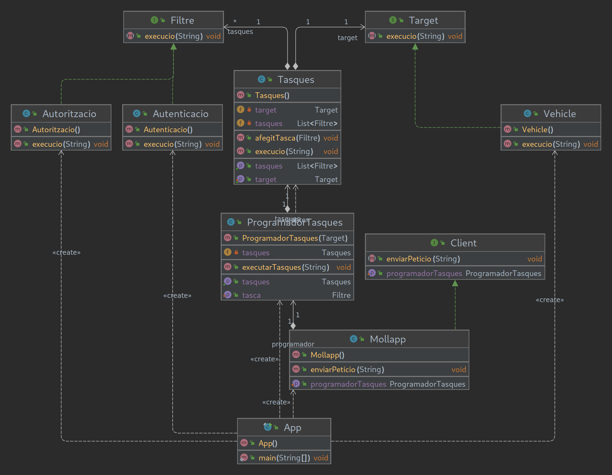

# Mollapp 

## II. Examen Programación DAW Dual
Se necesita un programa para autenticar y autorizar los usuarios de un nuevo servicio tipo *Uber*.  
Crea el programa con la ayuda del diagrama UML y usando el patron filtro. 

A program is needed to authenticate and authorize the users of a new *Uber-like* service.  
Create the program with the help of the UML diagram and using the filter pattern.  

## Key-Concepts :dart: 
- Specification/Filter Pattern
- UML Class Diagram
- Design/Implementation

## UML
